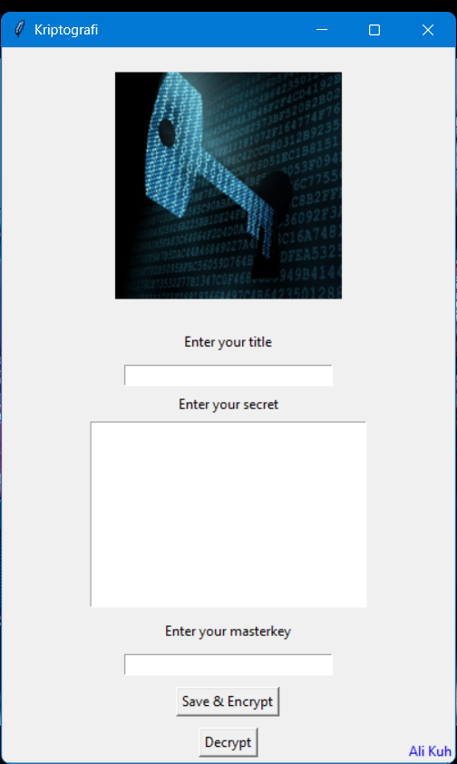

# 🔐 Cryptography - Python & Tkinter

This project is a desktop application developed using **Python** and **Tkinter**.  
Users can securely encrypt the text they enter with a **password** of their choice and decrypt it again using the same password.  
Encrypted data is stored in the **data.txt** file.

---

## ✨ Features
- 📌 Takes a title input from the user  
- 📌 Takes a secret text input from the user  
- 📌 Takes a password (master key) for encryption/decryption  
- 📌 Secure encryption using the Fernet algorithm  
- 📌 Saves encrypted data in Base64 readable format  
- 📌 One-click encryption (Encrypt) and decryption (Decrypt)  
- 📌 User-friendly Tkinter GUI  
- 📌 Error message on wrong password entry  

---

## 📷 Screenshot

---

## 🔑 Usage
1. Enter the title in the **Enter your title** field.  
2. Enter the text you want to encrypt in the **Enter your secret** field.  
3. Enter your chosen password in the **Enter your masterkey** field.  
4. Click **Save & Encrypt** to encrypt and save the data.  
5. To decrypt, enter the same title and correct password, then click **Decrypt**.

---

## 🔧 Technical Details

### 📦 Dependencies
- **cryptography** → Advanced cryptographic library for Python  
- **tkinter** → Built-in GUI framework (comes with Python)  
- **hashlib** → Cryptographic hash functions (built-in)  
- **base64** → Base64 encoding/decoding (built-in)  

---

### 🔐 Encryption Process
1. Plain text → UTF-8 encoding  
2. AES-256 based Fernet encryption  
3. Base64 encoding  
4. Saving to `data.txt` file  

---

### 🗝️ Key Generation Process
1. User’s password (master key)  
2. SHA-256 hashing for fixed-length secure key  
3. Base64 URL-safe encoding to Fernet-compatible key  
4. Used as Fernet key for encryption/decryption  

---

---

# 🔐 Kriptografi - Python & Tkinter

Bu proje, **Python** ve **Tkinter** kullanılarak geliştirilmiş bir masaüstü uygulamasıdır.  
Kullanıcı, girdiği metni kendi belirlediği **parola** ile güvenli şekilde şifreleyebilir ve aynı parola ile tekrar çözebilir.  
Şifrelenmiş veriler **data.txt** dosyasında saklanır.

---

## ✨ Özellikler
- 📌 Kullanıcıdan başlık (title) alma  
- 📌 Kullanıcıdan metin (secret) alma  
- 📌 Kullanıcıdan şifreleme/deşifreleme için parola alma  
- 📌 Fernet algoritması ile güvenli şifreleme  
- 📌 Base64 ile okunabilir formatta dosyaya kaydetme  
- 📌 Tek tıkla şifreleme (Encrypt) ve çözme (Decrypt)  
- 📌 Kullanıcı dostu Tkinter arayüzü  
- 📌 Yanlış parola girildiğinde uyarı mesajı  

---

## 📷 Ekran Görüntüsü

---

## 🔑 Kullanım
1. **Enter your title** alanına kaydın başlığını yazın.  
2. **Enter your secret** alanına şifrelemek istediğiniz metni yazın.  
3. **Enter your masterkey** alanına belirleyeceğiniz parolayı yazın.  
4. **Save & Encrypt** butonuna basarak şifreleyip kaydedin.  
5. Çözmek için aynı başlığı ve doğru parolayı girip **Decrypt** butonuna tıklayın.

---

## 🔧 Teknik Detaylar

### 📦 Bağımlılıklar
- **cryptography** → Python için gelişmiş kriptografik kütüphane  
- **tkinter** → Yerleşik GUI framework (Python ile birlikte gelir)  
- **hashlib** → Kriptografik hash fonksiyonları (yerleşik)  
- **base64** → Base64 kodlama/çözme işlemleri (yerleşik)  

---

### 🔐 Şifreleme Süreci
1. Düz Metin → UTF-8 Kodlama  
2. AES-256 tabanlı Fernet Şifreleme  
3. Base64 Kodlama  
4. `data.txt` dosyasına kaydetme  

---

### 🗝️ Anahtar Üretim Süreci
1. Kullanıcının girdiği parola (master key)  
2. SHA-256 Hash ile sabit uzunlukta güvenli hale getirme  
3. Base64 URL-Safe kodlama ile Fernet’in anlayacağı formata dönüştürme  
4. Fernet anahtarı olarak kullanma  

---
